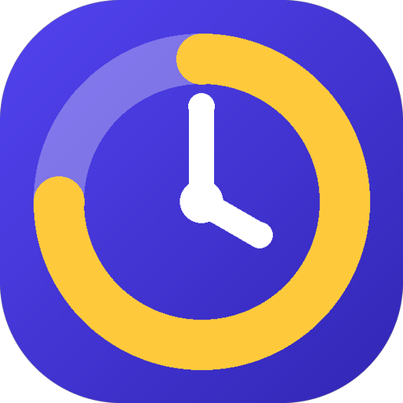

# Clockdown

Clockdown counts down to the things you don't want to miss, so you can stop checking the clock.

- **Countdowns for anything.** Create your own timers with a name, date, time, emoji and colour, and get an alarm before they start.
- **Your classes, automatically.** Connect your Amizone account once and your timetable shows up with live countdowns and alarms. You sign in on Amizone's own page. To make signing in again quicker, your ID and password can be kept encrypted on your phone (never sent anywhere except Amizone's own sign-in page), and you can delete them any time in Settings.
- **Attendance.** Your attendance from Amizone in its own tab: each subject's percentage in Amizone's own green, yellow and red, how many classes to attend to get back above 75% (or how many you can miss), which of today's classes have been marked, a recovery plan from your real timetable, and a leave planner. It stays on your phone, and it's refreshed when you open the app, pull down on the tab or tap the widget, with a little extra around class times.
- **Short alerts.** Class alerts play a two-second sound (five to choose from, all original: see [SOUNDS.md](SOUNDS.md)) and a quick buzz, then stop by themselves. Timers can optionally keep ringing until dismissed.
- **Home screen widgets.** A live ticking timer, your next classes, or a list of what's coming up, in your choice of looks: solid cards, gradients, bold, see-through glass and mono that adapt to your wallpaper, and more. Set one look for all class timers, or give each widget its own. After saving a timer, one tap puts it on your home screen.
- **Private by design.** No ads, no tracking, no analytics. Everything stays on your phone. The only internet use is talking to Amizone (if you connect it), checking this page for new versions, and, if the app crashes, sending a short crash report (the error and your phone model, never your ID, password or timetable). You can switch crash reports off in Settings.

## Install (Android 8 or newer)

1. On your phone, download [Clockdown.apk](https://github.com/nerdsanimein-ux/clockdown/releases/latest/download/Clockdown.apk) — this link always gets the newest version.
2. Open the downloaded file. If Android asks, allow your browser to "install unknown apps", then tap **Install**.
3. Open **Clockdown** and allow notifications when asked, so alarms can reach you.

**Android shows a warning?** That's normal for any app that doesn't come from the Play Store; it's about where the app came from, not what it does. If you see "Blocked by Play Protect" or "Harmful app", tap **More details** (or the small arrow), then **Install anyway**. If Android offers to scan the app first, you can tap **Scan**. The same steps are in the app under **Settings > How to install**.

**Updating:** after the first install, Clockdown checks for new versions by itself. When one is ready it shows a short "Clockdown X is available" box when you open the app (at most once a day; **Later** hides it for a day), sends one notification per version (switch it off in **Settings → About and updates**), and puts a dot on the Settings button. You can always open **Settings → Check for updates** and tap **Update now**.

**Staying signed in to Amizone:** Amizone's sign-in only lasts about 2½ hours unless it's used, so between 7 am and 11 pm Clockdown makes one tiny request roughly every 2 hours to keep it renewed. Overnight it does nothing; if Android delays it (battery savers) or the sign-in lapses, the one-tap reconnect still works.

## For developers

Build: `./gradlew assembleDebug` (needs JDK 21 and the Android SDK). Run the tests with `./gradlew testDebugUnitTest`.

Releasing:

1. In `app/build.gradle.kts`, raise `versionCode` by 1 and set `versionName` (for example `1.1`).
2. Put your signing details in `local.properties` (`release.storeFile`, `release.storePassword`, `release.keyAlias`, `release.keyPassword`). That file is git-ignored. Then run `./gradlew assembleRelease`.
3. Create a GitHub release whose **tag is exactly the new `versionCode`** (for example `2`), whose title is the version name, and whose description lists what's new in plain words. Attach `app/build/outputs/apk/release/app-release.apk` **twice**: once under the exact name `Clockdown.apk` (the permanent link students use always points here) and once under a versioned name like `Clockdown-1.2.apk` (the in-app updater just takes the first `.apk` it finds in the release, so this is what it actually fetches). Publish it as a normal release, not a draft or prerelease, so GitHub marks it **Latest** automatically.

Keep your signing key safe and backed up. Android only installs an update if it is signed with the same key as the version already on the phone. See `CLAUDE.md` for the full rule on why both asset names matter.
